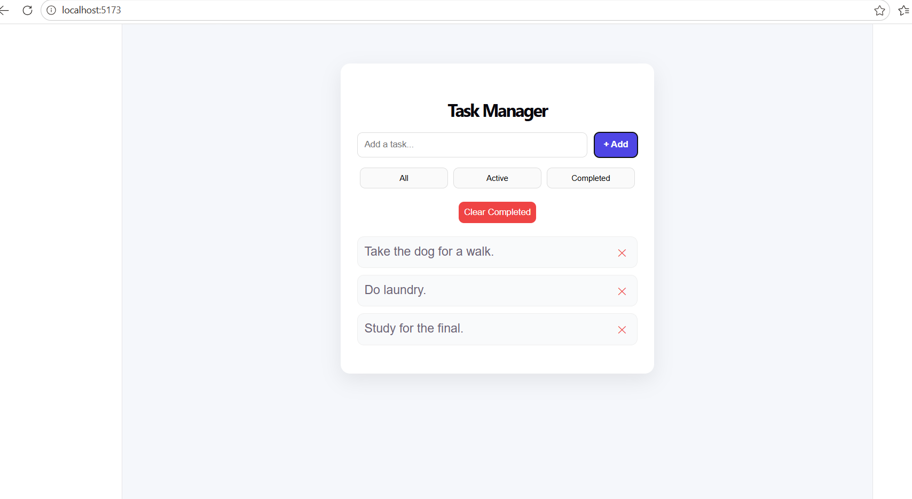

# React Task Manager

A modern task management web application built with React.

## 🚀 Features

* Add, delete, and edit tasks
* Mark tasks as completed
* Filter tasks (All / Active / Completed)
* Clear completed tasks
* Persistent storage using localStorage
* Keyboard support (Enter key)
* Clean and responsive UI

## 🛠️ Technologies Used

* React (Hooks)
* JavaScript (ES6+)
* HTML5 & CSS3

## 📸 Preview

(screenshot2.png)

## 📦 Installation

```bash
npm install
npm run dev
```

## 🌍 Live Demo

(https://inquisitive-kangaroo-7e952b.netlify.app/)

## 💡 What I Learned

* State management using React Hooks
* Handling user input and events
* Building reusable UI components
* Improving user experience with interactive features

## 📌 Author

Bianca Wagener

